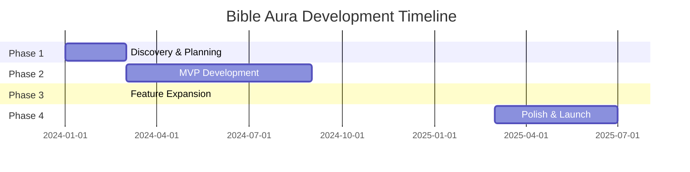

# ✦Bible Aura - 18 Month Development Plan
## 🎯 Executive Summary

**Project:** Bible Aura - AI-Powered Biblical Insights Platform  
**Duration:** 18 Months  
**Budget:** LKR 3,000,000 (~USD 10,000)  
**Target Market:** Global Christian Community  
**Platform:** Progressive Web App (PWA) with potential mobile app  

---

## 💰 Budget Overview

| Phase | Duration | Budget (LKR) | Budget (USD) | Percentage |
|-------|----------|--------------|--------------|------------|
| Phase 1: Discovery & Planning | Month 1-2 | 200,000 | 667 | 6.7% |
| Phase 2: MVP Development | Month 3-8 | 1,200,000 | 4,000 | 40% |
| Phase 3: Expansion & Features | Month 9-14 | 1,000,000 | 3,333 | 33.3% |
| Phase 4: Polish & Launch | Month 15-18 | 600,000 | 2,000 | 20% |
| **TOTAL** | **18 Months** | **3,000,000** | **10,000** | **100%** |

---

## 👥 Team Structure

### Core Team (Throughout Project)
- **1x Full-Stack Developer** - LKR 120,000/month (Primary developer)
- **1x UI/UX Designer** - LKR 80,000/month (Part-time 50%)
- **1x Project Manager** - LKR 60,000/month (Part-time 40%)
- **1x Theological Consultant** - LKR 40,000/month (Part-time 25%)

### Specialized Support (As Needed)
- **DevOps Engineer** - LKR 100,000 (One-time setup)
- **Content Creator** - LKR 50,000/month (Months 9-18)
- **QA Tester** - LKR 60,000/month (Months 6-18)
- **Marketing Specialist** - LKR 70,000/month (Months 15-18)

---

## 🟡 Phase 1: Discovery & Planning (Month 1-2)
**Budget: LKR 200,000**

### 📋 Key Activities

#### Week 1-2: Product Discovery
- **Market Research & Competitor Analysis**
  - Study existing Bible apps (YouVersion, Logos, etc.)
  - Identify gaps and opportunities
  - Define unique value proposition

- **User Research**
  - Survey 100+ potential users
  - Create user personas
  - Define user journey maps

#### Week 3-4: Technical Planning
- **Architecture Design**
  - Database schema design
  - API structure planning
  - Infrastructure requirements

- **Technology Stack Finalization**
  - Frontend: React 18, TypeScript, Tailwind CSS, Vite
  - Backend: Supabase (PostgreSQL, Auth, Storage)
  - AI: OpenAI API, Custom prompt engineering
  - Hosting: Vercel/Netlify + Supabase Cloud

#### Week 5-6: Design & Planning
- **UI/UX Design**
  - Create design system
  - Wireframes for all major screens
  - High-fidelity mockups (Figma)
  - Mobile-first responsive design

- **Project Planning**
  - Detailed sprint planning
  - Risk assessment
  - Communication protocols

#### Week 7-8: Documentation & Setup
- **Technical Documentation**
  - API documentation
  - Database schema documentation
  - Coding standards and guidelines

- **Development Environment Setup**
  - Git repository setup
  - CI/CD pipeline configuration
  - Development tools and workflows

### 📦 Deliverables
- ✅ Product Requirements Document (PRD)
- ✅ Technical Architecture Document
- ✅ UI/UX Design System & Mockups
- ✅ Project Timeline & Sprint Plans
- ✅ Risk Management Plan
- ✅ Development Environment Setup

### 💸 Budget Breakdown
- Project Manager: LKR 48,000 (2 months × 60,000 × 40%)
- UI/UX Designer: LKR 80,000 (2 months × 80,000 × 50%)
- Research & Tools: LKR 30,000
- Documentation: LKR 20,000
- Contingency: LKR 22,000

---

## 🟢 Phase 2: MVP Development (Month 3-8)
**Budget: LKR 1,200,000**

### 📋 Key Activities

#### Month 3-4: Core Infrastructure
- **Authentication System**
  - User registration/login
  - Google OAuth integration
  - Profile management
  - Password recovery

- **Database Setup**
  - Bible verses database (multiple translations)
  - User data models
  - Bookmarks and notes structure
  - Basic analytics tracking

- **Basic Frontend**
  - Landing page
  - Authentication pages
  - Dashboard layout
  - Navigation system

#### Month 5-6: Bible Reading Features
- **Bible Reader**
  - Multiple translations support
  - Chapter/verse navigation
  - Search functionality
  - Responsive design

- **Personal Features**
  - Bookmarks system
  - Personal notes
  - Reading history
  - Favorites

- **Basic AI Integration**
  - OpenAI API integration
  - Simple Q&A about verses
  - Basic context explanations

#### Month 7-8: AI Oracle & Polish
- **AI Chat Oracle**
  - Conversational interface
  - Biblical context awareness
  - Multi-turn conversations
  - Response quality optimization

- **Search & Discovery**
  - Advanced search features
  - Topical search
  - Cross-references (basic)

- **Mobile Optimization**
  - Progressive Web App (PWA)
  - Offline reading capability
  - Mobile performance optimization

### 📦 Deliverables
- ✅ Functional MVP with core features
- ✅ User authentication system
- ✅ Bible reading with 5+ translations
- ✅ AI-powered Q&A system
- ✅ Personal bookmarks and notes
- ✅ Mobile-responsive design
- ✅ Basic search functionality

### 💸 Budget Breakdown
- Full-Stack Developer: LKR 720,000 (6 months × 120,000)
- UI/UX Designer: LKR 240,000 (6 months × 80,000 × 50%)
- Project Manager: LKR 144,000 (6 months × 60,000 × 40%)
- AI API Costs: LKR 36,000 (6 months × 6,000)
- Infrastructure: LKR 30,000 (Hosting, domains, tools)
- Testing & QA: LKR 30,000

---

## 🔵 Phase 3: Expansion & Learning Tools (Month 9-14)
**Budget: LKR 1,000,000**

### 📋 Key Activities

#### Month 9-10: Advanced Study Tools
- **Cross References System**
  - Automatic cross-reference detection
  - Visual cross-reference display
  - Related verses suggestions

- **Topical Studies**
  - 500+ theological topics
  - AI-generated study guides
  - Topic-based verse collections

- **Hebrew/Greek Word Studies**
  - Strong's concordance integration
  - Original language lookup
  - Word meaning explanations

#### Month 11-12: Content & Media
- **Daily Verse System**
  - Automated daily verse selection
  - AI-generated daily reflections
  - Notification system

- **Study Plans**
  - Pre-built reading plans
  - Custom plan creation
  - Progress tracking
  - Achievement system

- **Sermons & Media**
  - Sermon library setup
  - Audio/video integration
  - Content management system
  - Search and categorization

#### Month 13-14: AI Enhancement
- **Advanced AI Features**
  - Contextual verse explanations
  - Historical background information
  - Application suggestions
  - Theological insights

- **Personalization**
  - AI-powered recommendations
  - Personalized study paths
  - Learning analytics
  - User behavior insights

### 📦 Deliverables
- ✅ Complete study tools suite
- ✅ Advanced AI capabilities
- ✅ Sermon and media library
- ✅ Daily verse and study plans
- ✅ Cross-references and topics
- ✅ Hebrew/Greek word studies
- ✅ Personalization features

### 💸 Budget Breakdown
- Full-Stack Developer: LKR 720,000 (6 months × 120,000)
- Content Creator: LKR 150,000 (6 months × 50,000 × 50%)
- QA Tester: LKR 90,000 (6 months × 60,000 × 25%)
- AI API Costs: LKR 30,000 (Enhanced usage)
- Content Licensing: LKR 10,000

---

## 🟣 Phase 4: Polish & Launch (Month 15-18)
**Budget: LKR 600,000**

### 📋 Key Activities

#### Month 15-16: Optimization & Testing
- **Performance Optimization**
  - Code optimization
  - Database query optimization
  - Image and asset optimization
  - Loading speed improvements

- **Comprehensive Testing**
  - User acceptance testing
  - Performance testing
  - Security testing
  - Cross-browser testing
  - Mobile device testing

- **Bug Fixes & Polish**
  - UI/UX refinements
  - Bug fixes and improvements
  - User experience optimization

#### Month 17-18: Launch Preparation
- **SEO & Analytics**
  - Search engine optimization
  - Google Analytics setup
  - Performance monitoring
  - User behavior tracking

- **Marketing & Content**
  - Launch website updates
  - Social media content creation
  - Demo videos and tutorials
  - User onboarding flow

- **App Store Preparation**
  - PWA optimization
  - App store assets
  - Store listing optimization
  - Launch strategy

### 📦 Deliverables
- ✅ Production-ready application
- ✅ Comprehensive testing complete
- ✅ Performance optimized
- ✅ SEO optimized
- ✅ Marketing materials ready
- ✅ Soft launch executed
- ✅ User feedback incorporated

### 💸 Budget Breakdown
- Full-Stack Developer: LKR 240,000 (4 months × 120,000 × 50%)
- QA Tester: LKR 120,000 (4 months × 60,000 × 50%)
- Marketing Specialist: LKR 140,000 (4 months × 70,000 × 50%)
- Content Creation: LKR 60,000
- Launch Costs: LKR 40,000

---

## 🛠️ Technology Stack

### Frontend
- **Framework:** React 18 with TypeScript
- **Styling:** Tailwind CSS + Shadcn/UI
- **Build Tool:** Vite
- **State Management:** Zustand/React Query
- **PWA:** Workbox for offline functionality

### Backend
- **Database:** Supabase (PostgreSQL)
- **Authentication:** Supabase Auth
- **Storage:** Supabase Storage
- **Real-time:** Supabase Realtime
- **API:** RESTful + GraphQL (optional)

### AI & APIs
- **Primary AI:** OpenAI GPT-4
- **Bible API:** Custom integration with multiple sources
- **Search:** Elasticsearch or Algolia
- **Analytics:** Google Analytics 4

### Infrastructure
- **Hosting:** Vercel (Frontend) + Supabase Cloud
- **CDN:** Vercel Edge Network
- **Domain:** Custom domain
- **SSL:** Automatic HTTPS
- **Monitoring:** Vercel Analytics + Sentry

---

## 📊 Success Metrics

### Phase 1-2 (MVP)
- ✅ 100+ beta users registered
- ✅ 70%+ user retention after 1 week
- ✅ 50+ daily active users
- ✅ <3 second page load times

### Phase 3-4 (Full Launch)
- 🎯 1,000+ registered users
- 🎯 80%+ user satisfaction score
- 🎯 500+ daily active users
- 🎯 50+ user reviews (4+ stars)
- 🎯 10,000+ monthly page views

---

## ⚠️ Risk Management

### Technical Risks
- **AI API Costs** - Monitor usage, implement caching
- **Performance Issues** - Regular performance testing
- **Data Loss** - Automated backups, redundancy
- **Security Breaches** - Security audits, best practices

### Business Risks
- **Budget Overrun** - Monthly budget reviews, contingency planning
- **Timeline Delays** - Agile methodology, regular check-ins
- **Market Changes** - Flexible feature prioritization
- **Team Issues** - Clear contracts, backup resources

### Mitigation Strategies
- 📋 Weekly progress reviews
- 💰 10% budget contingency per phase
- 🔄 Agile development with 2-week sprints
- 📞 Regular stakeholder communication
- 🧪 Continuous user feedback integration

---

## 📅 Detailed Timeline

---

## 🎯 Final Deliverables

### Technical
- ✅ Production-ready web application
- ✅ Mobile-optimized Progressive Web App
- ✅ Complete source code with documentation
- ✅ Database with 50,000+ verses and content
- ✅ AI-powered biblical Q&A system

### Business
- ✅ 1,000+ registered users
- ✅ Sustainable user engagement metrics
- ✅ Marketing website and materials
- ✅ User support documentation
- ✅ Analytics and monitoring setup

### Legal & Compliance
- ✅ Privacy policy and terms of service
- ✅ GDPR compliance
- ✅ Content licensing agreements
- ✅ Security compliance documentation

---

## 💡 Next Steps

1. **Immediate Actions (Week 1)**
   - Finalize team contracts
   - Set up project management tools
   - Begin market research

2. **Month 1 Goals**
   - Complete user research
   - Finalize product requirements
   - Begin UI/UX design

3. **Success Tracking**
   - Weekly team meetings
   - Monthly stakeholder reviews
   - Quarterly budget assessments

---

**Document Version:** 1.0  
**Last Updated:** January 2025  
**Next Review:** February 2025

---

*This plan serves as a comprehensive roadmap for developing Bible Aura into a world-class biblical study platform. Regular reviews and adjustments will ensure we stay on track to deliver exceptional value to our users within budget and timeline constraints.* 